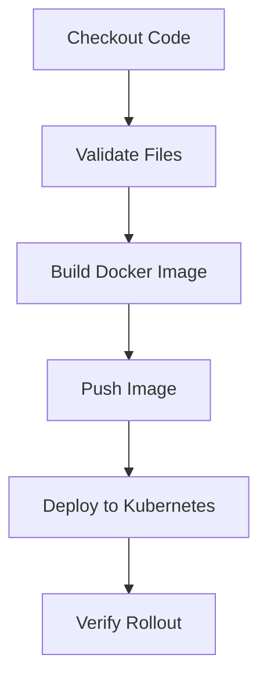

# Jenkins CI/CD Pipeline

A practical Jenkins CI/CD portfolio project for building a Docker image and deploying an application to Kubernetes.

This repository demonstrates a common DevOps pipeline flow: source checkout, validation, Docker image build, registry push, Kubernetes deployment, and rollout verification.

## Tech Stack

| Area | Tools / Services |
|---|---|
| CI/CD | Jenkins Declarative Pipeline |
| Containerization | Docker |
| Deployment Target | Kubernetes / EKS |
| Registry | Docker Hub or any container registry |
| Scripting | Shell scripting |
| Validation | Basic project validation and rollout status check |

## What This Project Demonstrates

- Jenkins Declarative Pipeline structure
- Docker image build and push workflow
- Secure credential usage in Jenkins
- Kubernetes deployment update using image tags
- Rollout verification after deployment
- Failure handling with clear pipeline post actions
- Simple validation script before image build

## Pipeline Flow



## Repository Structure

```text
.
├── Jenkinsfile
├── app/
│   ├── Dockerfile
│   └── index.html
├── scripts/
│   └── validate.sh
├── docs/
│   └── pipeline-notes.md
└── README.md
```

## Jenkins Credentials Required

| Credential ID | Purpose |
|---|---|
| dockerhub-creds | Docker registry username/password |
| kubeconfig-dev | Kubernetes cluster access file |

## Run Locally

Validate project files:

```bash
bash scripts/validate.sh
```

Build Docker image:

```bash
docker build -t devops-demo-app:local ./app
```

## Jenkins Pipeline Stages

1. Checkout source code
2. Validate required files
3. Build Docker image
4. Push image to registry
5. Deploy updated image to Kubernetes
6. Verify Kubernetes rollout status

## Production Improvements

- Use Git commit SHA or release tag as Docker image tag
- Add image vulnerability scanning using Trivy or Docker Scout
- Add approval gate before production deployment
- Use separate credentials for dev, stage, and prod
- Add automatic rollback for failed rollout
- Add Slack or email notifications for deployment status

## Interview Talking Points

This project can be used to explain:

- How Jenkins pipelines are structured in real projects
- How Docker image tagging works in CI/CD
- How Jenkins credentials keep secrets out of code
- How Kubernetes deployments can be updated from a pipeline
- How rollout status helps catch failed deployments
- How rollback can be handled after deployment failure

## Author

**Sandesh Prabhakar T**  
Senior DevOps Engineer | Jenkins | Docker | Kubernetes | AWS | Terraform | Linux
